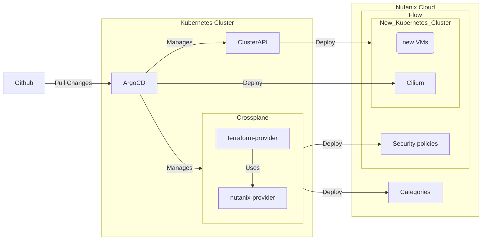

# Purpose
This repository is to use an entirely Kubernetes-style management to create a new and safe Kurbernetes cluster on the Nutanix Cloud environment with mircrosegmentation manage by Nutanix Flow.

We assume that you have Nutanic [Prism Central](https://portal.nutanix.com/page/documents/details/?targetId=Prism-Central-Guide-Prism-v55:Prism-Central-Guide-Prism-v55) and [Flow](https://portal.nutanix.com/page/documents/details?targetId=Nutanix-Flow-Guide:Nutanix-Flow-Guide) enabled and you have a working Kurbeernetes cluster. In the instruction, I am using the Kubernetes Cluster from [Nutanix Kubernetes Engin(NKE)](https://www.nutanix.dev/api_references/nke/#/4b402d5ab3edd-index) 

Here is an overview of the architecture



# Pre-requisitcs

1\) For this operation you would need to install the following in your command line tool
- [`kubectl`](https://kubernetes.io/docs/tasks/tools/)
- [`argocd`](https://argo-cd.readthedocs.io/en/stable/cli_installation/)
- [`clusterctl`](https://cluster-api.sigs.k8s.io/user/quick-start.html)

2\) You also need to install the following in your Kubernetes cluster
- [`Helm`](https://helm.sh/docs/intro/install/)
- [`Crossplane`](https://docs.crossplane.io/latest/software/install/)
- [`Cluster` `API`](https://cluster-api.sigs.k8s.io/user/quick-start.html)
- [`ArgoCD`](https://argo-cd.readthedocs.io/en/stable/getting_started/)

3.1) Configure your `kubectl`. In this example, we are using the Kubernetest cluster from NKE and you should also download the kubeconfig file from Prism Central as shown below


3.2) Rename the file to `config` and move it to `~/.kube`. Below is an example for MacOs users.
```bash
mv ~/Downloads/config ~/.kube
```

3.3) To ensure that you are connected to the cluster correctly you can simply enter `kubectl get nodes` to get a response. If you get the following error, message please check your steps.

```bash
E0801 19:26:28.316006   67075 memcache.go:265] couldn't get current server API group list: Get "http://localhost:8080/api?timeout=32s": context deadline exceeded - error from a previous attempt: read tcp [::1]:52
```

4\) You need to have an additional terminal to forward the argocd server to your localhost to log in later.

```bash
kubectl port-forward svc/argocd-server -n argocd 8080:443
```

5\) Since we are using the Nutanix Provider in `Terraform`, it requires us to have a state file. Here is how we manage this problem 
- install [Terraform](https://developer.hashicorp.com/terraform/tutorials/aws-get-started/install-cli)
- run `terraform init` to generate the `terraform.tfstate`
- Create a Kubernetes secret `kubectl create secret generic terraform-state-secret --from-file=state.tfstate=path/to/your/state/terraform.tfstate
`
- Ensure that it matches for the `backend` in `/templates/provider-config.yaml`

# Setting up cluster

1\) In a new terminal use the following comand to log into your argocd account

```bash
argocd login localhost:8080
```

2\) Create a new namespace for your cluster

```bash
kubectl create namespace <new-namespace>
```

3\) Create the an Argo CD Application

```bash
argocd app create <argocd-application-name> --repo https://github.com/junwei26/CAPI-edge-deployment.git --dest-namespace default --dest-server https://kubernetes.default.svc --path ./
```
4\) Since the github repo only has the template, you need to do the following to set up your own values

```bash
argocd app set <argocd-application-name>\
--values values.yaml \
-p namespace=<new-namespace>\
-p nke_cluster_name=<k8s-cluster-name>\
-p control_plane_endpoint=<control-place-endpoint>\
-p user=<user-name>\
-p password=<password>\
-p ssh_pub_key=<public-key>\

argocd app sync <argocd-application-name> --resource pkg.crossplane.io:Provider:<provider-name>
argocd app sync <argocd-application-name> --resource tf.upbound.io:ProviderConfig:<providerconfig-name>
argocd app sync <argocd-application-name> --resource tf.upbound.io:Workspace:<workspace-name>
argocd app sync <argocd-application-name>
```

5\) At this stage, you should have most things set up correctly and you can run the following to get a status report. Not everything will be running imeddiately because we have not set up the network.

```bash
clusterctl describe --show-conditions all cluster <k8s-cluster-name> -n <new-namespace>
```

This is what the status will look like


6\) Finally you can set up the internal networking. As an example, we use `cilium`

```bash
argocd app create <cilium-application-name> --repo https://helm.cilium.io/ --helm-chart cilium --revision 1.14.0 --dest-namespace kube-system --dest-server https://<control-place-endpoint>:6443 # 6443 is the default port for control plane

argocd app sync <cilium-application-name>
```

7\) Monitor the setting up progress by running the following code repeatedly

```bash
clusterctl describe --show-conditions all cluster <k8s-cluster-name> -n <new-namespace>
```

When everything is ready, the ready state should be `True` for everything.


8\) You can also see that the security policies has been set up for you


# Possible torubleshoot

Along the way we face some issues and here are some possible solutions for you to try

1\) Unable to delete namespace

This happens when you incorrectly delete some resources and they remain stucked in the terminating phase. I took reference form [here](https://www.ibm.com/docs/en/cloud-private/3.2.0?topic=console-namespace-is-stuck-in-terminating-state). You can run the following
```
kubectl api-resources --verbs=list --namespaced -o name | xargs -n 1 kubectl get --show-kind --ignore-not-found -n <terminating namespace>
```

and then you can use `kubectl edit` to delete the `finalizer` field to force the deletion of each resource to happen.

2\) Unusable IP address or names

Some IP addresses or names from prism central cannot be use because it is used for other purposes. You just have to swap with another one. 

3\) Unsure what is wrong

It might help to use the Graphical User Interface (GUI) for ArgoCD if you are not familiar with `argocd` or `kubectl`. You can log in to ArgoCD GUI on `localhost:8080/` because of the portforwarding we did earlier. You can look at the details of the component and read the event log.

# Customisation

To write your own network policy, you have refer to the nutanix provider for terraform [here](https://github.com/nutanix/terraform-provider-nutanix)

You may also change some of the values in `values.yaml` for your own use case. 

To modify the vm specifications, you may find them in `/templates/cluster.yaml`